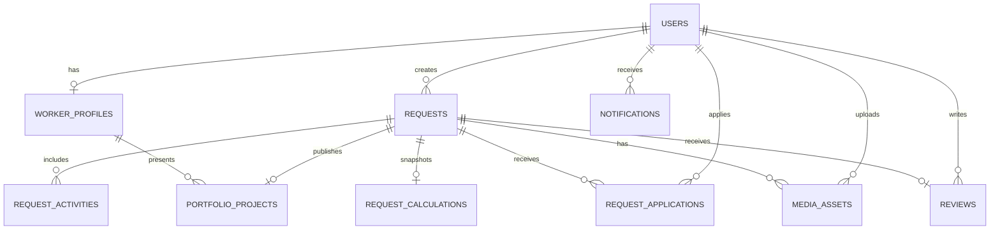

# Bricky Sprint 2 Canonical Data Model

Updated: 2026-07-05

Status: proposed P0 contract for technical approval. No production data is changed by this document.

## Goals

The model must support one traceable lifecycle:

```text
client creates request
-> worker applies
-> client assigns worker
-> work starts
-> worker completes with after evidence
-> client reviews
-> completed job may be published in worker portfolio
```

Every actor, state transition, price snapshot, media asset, and review must be attributable and queryable without parsing Bulgarian labels, comma-separated ids, or browser data URLs.

## Canonical Decisions

### Actor identity

- `users.id` is the only authenticated actor id.
- JWT `sub`/`req.user.id` is `users.id`.
- `worker.id` is a profile-row id only and is never accepted as an API actor id.
- One worker user has at most one worker profile.
- Authentication fields live only in `users`.
- `worker.email`, `worker.password`, and `worker.phone` are legacy duplicates and must leave active use before removal.

### Stable identifiers

- Request status uses machine constants, not translated UI text.
- Repair categories and activities use stable keys.
- Bulgarian labels are presentation data.
- File storage uses immutable storage keys, not an absolute host URL as identity.

### Historical values

- A request stores an immutable calculator snapshot.
- Historical estimates never recalculate from a newer price configuration.
- Completed-job history is based on completed requests and immutable completion evidence.

## Target ERD



## Target Tables

### `users`

Required fields:

- `id` primary key;
- `name`;
- `email` unique, normalized for comparison;
- `passwordHash`;
- `role`: `client`, `worker`, `moderator`, `admin`;
- `status`: `pending`, `active`, `suspended`, `deleted`;
- `emailVerifiedAt` nullable;
- `createdAt`, `updatedAt`, `deletedAt` nullable.

Rules:

- soft delete user accounts after the retention workflow is implemented;
- never return password hashes;
- role and account status are validated on every protected request.

### `worker_profiles`

Required fields:

- `id` primary key;
- `userId` unique FK to `users.id`, `ON DELETE RESTRICT` until account erasure is implemented;
- public name/company, city/service area, description, experience, equipment;
- approval/status fields;
- optional avatar media id;
- timestamps.

Skills should not remain a comma-separated string. Use `worker_skills(workerUserId, categoryKey)` or a JSON array only as an explicitly temporary compatibility field.

Remove from active ownership:

- duplicated email;
- duplicated password;
- public phone number.

### `repair_categories` and `repair_activities`

`repair_categories`:

- stable `key` unique;
- display label, description, icon key, sort order, active flag.

`repair_activities`:

- stable `key` unique inside category;
- `categoryKey` FK;
- display label;
- unit type;
- active flag and sort order.

Pricing versions may reference these keys, but old request snapshots remain self-contained.

### `requests`

Required fields:

- `id` primary key;
- `clientUserId` FK to `users.id`;
- `assignedWorkerUserId` nullable FK to `users.id`;
- `categoryKey` FK or validated stable key;
- `status`: `new`, `applied`, `assigned`, `in_progress`, `completed`, `canceled`;
- free-form description;
- address display text;
- latitude/longitude nullable;
- location source;
- address visibility level: `private`, `approximate`, `assigned_worker`;
- `assignedAt`, `startedAt`, `completedAt`, `canceledAt` nullable;
- created/updated timestamps;
- optimistic `version` or equivalent concurrency protection.

Do not persist copied client email/phone as request truth unless a separate immutable contact snapshot is an approved business requirement.

Allowed transitions:

```text
new -> applied | canceled
applied -> assigned | canceled
assigned -> in_progress | applied | canceled
in_progress -> completed | canceled
completed -> terminal
canceled -> terminal
```

Every transition runs in one database transaction and writes an audit event.

### `request_activities`

- `requestId` FK;
- `categoryKey`;
- stable `activityKey`;
- activity label snapshot;
- quantity and unit nullable;
- sort order;
- unique `(requestId, activityKey)` where the product does not allow duplicate lines.

This makes filtering and reporting possible while the immutable calculation JSON preserves full historical detail.

### `request_applications`

- `requestId` FK `ON DELETE CASCADE`;
- `workerUserId` FK `ON DELETE RESTRICT`;
- status: `applied`, `assigned`, `withdrawn`, `rejected`;
- optional offer min/max/currency and message;
- timestamps;
- unique `(requestId, workerUserId)`.

`requests.appliedWorkers` is removed only after backfill and read-path verification.

### `request_calculations`

One immutable accepted snapshot per request for v1. If recalculation history is required later, use multiple rows and an `isAccepted` marker.

Required fields:

- `requestId` unique FK `ON DELETE CASCADE`;
- pricing, material-rule, and material-index versions;
- currency;
- pricing mode;
- category/activity key snapshots;
- exact area and all quantities/units;
- modifier inputs;
- labor, material, expected, possible, and total min/max;
- confidence, warnings, assumptions, and exclusions JSON;
- calculated timestamp;
- full canonical snapshot JSON for audit/debugging.

### `media_assets`

One storage abstraction for request before/after evidence, avatars, gallery images, and portfolio covers.

Required fields:

- `id` primary key;
- `ownerUserId` FK;
- `requestId` nullable FK;
- role: `request_before`, `request_after`, `worker_avatar`, `worker_gallery`, `portfolio`;
- storage provider and immutable `storageKey` unique;
- MIME type, size, width, height, checksum;
- moderation status: `pending`, `approved`, `rejected`;
- visibility: `private`, `request_participants`, `public`;
- sort order and timestamps;
- deleted timestamp for controlled cleanup.

Production must not store base64/data URLs in this table. URL generation belongs to the media service.

### `reviews`

- `requestId` unique FK to a completed request;
- `clientUserId` FK;
- `workerUserId` FK;
- rating constrained to 1 through 5;
- optional comment;
- moderation status and timestamps.

Current `reviews.completedAt` and `reviews.completedByWorkerId` are misplaced legacy/entity fields. Completion belongs to `requests` and must be removed through a migration after checking the physical production schema.

### `portfolio_projects`

- `id` primary key;
- `workerUserId` FK;
- `requestId` unique FK to a completed request;
- title/category/description snapshots;
- publication status and published timestamp;
- cover media id nullable.

Before/after media remains owned by the completed request and is referenced for presentation. Do not duplicate file bytes.

### `notifications`

- `userId` FK;
- `requestId` nullable FK;
- stable notification type;
- payload JSON for rendering;
- read timestamp, created timestamp.

Rendered Bulgarian message text may be cached, but a stable type/payload is the canonical behavior contract.

### `request_events`

Append-only audit records:

- request id;
- actor user id nullable for system events;
- event type;
- previous/next status;
- metadata JSON;
- created timestamp.

Events support disputes, support investigation, analytics, and safe lifecycle debugging.

## Required Indexes

- `users(email)` unique;
- `worker_profiles(userId)` unique;
- `requests(clientUserId, createdAt)`;
- `requests(assignedWorkerUserId, status, updatedAt)`;
- `requests(status, categoryKey, createdAt)`;
- map bounding-box indexes or spatial index after provider/query design is approved;
- `request_applications(workerUserId, status, createdAt)`;
- `request_applications(requestId, status)`;
- `media_assets(requestId, role, sortOrder)`;
- `media_assets(ownerUserId, role, createdAt)`;
- `reviews(workerUserId, createdAt)`;
- `notifications(userId, readAt, createdAt)`;
- `request_events(requestId, createdAt)`.

## Authorization Invariants

- Client can read/mutate only owned requests unless the endpoint is intentionally public.
- Worker feed/map never exposes exact private address before the approved lifecycle point.
- Worker can apply only once to an open request.
- Client can assign only an applicant to an owned request.
- Only assigned worker can start/complete work and upload after evidence.
- Only owning client can review a completed request, once.
- Public portfolio includes only approved media and published completed jobs.
- Moderator actions are audited.

## Transaction Boundaries

These operations must be atomic:

1. create request + activities + calculation snapshot + media metadata;
2. apply + request status/event update;
3. assign + application statuses + request assignment + notification/event;
4. unassign/reopen + application/request/event updates;
5. complete + after media metadata + timestamps + portfolio draft + notification/event;
6. review + rating aggregate/event update if aggregates are stored.

Physical file deletion cannot be fully transactional with MySQL. Use an outbox/cleanup job and idempotent storage operations.

## Compatibility Removal Gates

Do not remove a legacy field until all gates pass:

1. backup verified by restore;
2. forward migration passes on restored production data;
3. backfill row counts and orphan checks pass;
4. new read path is enabled and tested;
5. dual-write is disabled;
6. lifecycle integration and browser E2E tests pass;
7. rollback is rehearsed;
8. post-deploy smoke is green.

Legacy fields covered by this rule:

- `requests.category` display string;
- localized request status;
- `requests.appliedWorkers`;
- `requests.photos`, `beforePhotos`, `afterPhotos`;
- raw assigned/completed ids without FKs;
- duplicated worker auth/contact fields;
- unstructured worker skills;
- misplaced review completion fields.

## Open Decisions For Technical Approval

1. Incremental migration of current tables or new v2 tables with backfill/switch-over?
2. Local persistent volume or object storage for media?
3. Exact-address visibility before and after assignment?
4. Is `assigned` distinct from `in_progress` in the first production state machine?
5. Database-managed catalog or config-managed catalog with DB publication later?
6. One accepted calculator snapshot or full recalculation history?
7. Soft-delete and legal retention periods for accounts, requests, messages, and media?
8. Whether portfolio publication is automatic after completion or requires client/worker/moderator consent?

## Acceptance Evidence

Approval requires:

- reviewed ERD and state machine;
- field-by-field mapping from current schema;
- forward and rollback migrations;
- restored-dump rehearsal report;
- zero unexpected orphans;
- integration tests for every transition and ownership rule;
- real multipart media lifecycle test;
- staging smoke and rollback demonstration.
